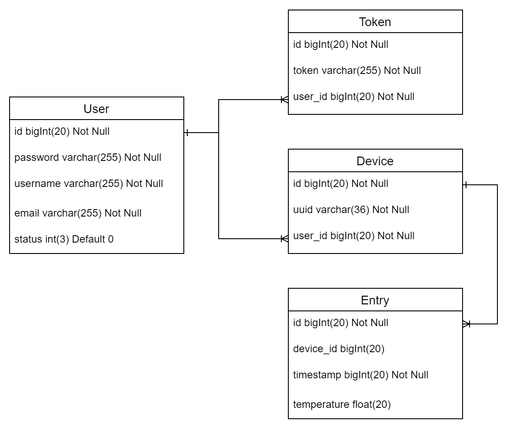

<div id="top"></div>
<!--
*** Thanks for checking out the Best-README-Template. If you have a suggestion
*** that would make this better, please fork the repo and create a pull request
*** or simply open an issue with the tag "enhancement".
*** Don't forget to give the project a star!
*** Thanks again! Now go create something AMAZING! :D
-->

<!-- PROJECT SHIELDS -->
<!--
*** I'm using markdown "reference style" links for readability.
*** Reference links are enclosed in brackets [ ] instead of parentheses ( ).
*** See the bottom of this document for the declaration of the reference variables
*** for contributors-url, forks-url, etc. This is an optional, concise syntax you may use.
*** https://www.markdownguide.org/basic-syntax/#reference-style-links
-->
[![Contributors][contributors-shield]][contributors-url]
[![Forks][forks-shield]][forks-url]
[![Stargazers][stars-shield]][stars-url]
[![Issues][issues-shield]][issues-url]
[![MIT License][license-shield]][license-url]
[![LinkedIn][linkedin-shield]][linkedin-url]

<h3 align="center">Temperature Monitoring System</h3>

<div>
  <p align="center">
    A web application for temperature dataset visualization
</div>

<!-- TABLE OF CONTENTS -->
<details>
  <summary>Table of Contents</summary>
  <ol>
    <li>
      <a href="#about-the-project">About The Project</a>
      <ul>
        <li><a href="#built-with">Built With</a></li>
      </ul>
    </li>
    <li>
      <a href="#getting-started">Getting Started</a>
      <ul>
        <li><a href="#prerequisites">Prerequisites</a></li>
        <li><a href="#installation">Installation</a></li>
      </ul>
    </li>
    <li><a href="#usage">Usage</a></li>
    <li><a href="#roadmap">Roadmap</a></li>
    <li><a href="#contributing">Contributing</a></li>
    <li><a href="#license">License</a></li>
    <li><a href="#contact">Contact</a></li>
    <li><a href="#acknowledgments">Acknowledgments</a></li>
  </ol>
</details>


<!-- ABOUT THE PROJECT -->

## About The Project
User is able to register and login to use the visualization tool. <br>
[login-page] <br>
[registration-page] <br><br>

Simply upload the dataset and the application is going to visualize the data. <br>
Train the model with your own dataset and predict the future readings with the model.<br><br>


<p align="right">(<a href="#top">back to top</a>)</p>

### Built With

* [Spring](https://spring.io/)
* [Vue.js](https://vuejs.org/)
* [Bootstrap](https://getbootstrap.com)

<p align="right">(<a href="#top">back to top</a>)</p>


<!-- GETTING STARTED -->

## Getting Started

### Prerequisites
The easiest way to set up the database is using XAMPP as the server for database hosting.

* Download XAMPP from the following link: https://www.apachefriends.org/download.html
* Follow the link https://www.javatpoint.com/creating-mysql-database-with-xampp on how to setup the database.
* Setup the database according to the ER-diagram below:


### Installation

1. Clone the repo
   ```
   git clone https://github.com/Quart3z/Temperature-Monitoring-System.git
   ```
   
2. Replace the followings properties according to your preference in the file [src/main/resources/application.properties](src/main/resources/application.properties):
   ```
   // Configuration of database
   spring.datasource.url=jdbc:mysql:[DATABASE_URL]
   spring.datasource.username= [DATABASE_USERNAME]
   spring.datasource.password= [DATABASE_PASSWORD]
   spring.datasource.driver-class-name =com.mysql.cj.jdbc.Driver
   
   spring.servlet.multipart.max-file-size=100MB
   spring.servlet.multipart.max-request-size=100MB
   server.servlet.session.persistent=false
   
   // Configuration of the sender for email verification
   spring.mail.host=smtp.gmail.com
   spring.mail.port=587
   spring.mail.username=[EMAIL]
   spring.mail.password=[EMAIL_PASSWORD]
   ```
   
3. Make sure to be in the root directory

4. Build and package the project with the command:
   ```
   mvn package
   ```
   
5. Run the built JAR with the command:
   ```
   java -jar target/backend-0.0.1-SNAPSHOT.jar
   ```

6. Open the web application with the link http://localhost:8080/ on the browser.

<p align="right">(<a href="#top">back to top</a>)</p>

<!-- LICENSE -->

## License

Distributed under the MIT License. See `LICENSE.txt` for more information.

<p align="right">(<a href="#top">back to top</a>)</p>


<!-- MARKDOWN LINKS & IMAGES -->
<!-- https://www.markdownguide.org/basic-syntax/#reference-style-links -->

[contributors-shield]: https://img.shields.io/github/contributors/Quart3z/Temperature-Monitoring-System.svg?style=for-the-badge
[contributors-url]: https://github.com/Quart3z/Temperature-Monitoring-System/graphs/contributors

[forks-shield]: https://img.shields.io/github/forks/Quart3z/Temperature-Monitoring-System.svg?style=for-the-badge
[forks-url]: https://github.com/Quart3z/Temperature-Monitoring-System/network/members

[stars-shield]: https://img.shields.io/github/stars/Quart3z/Temperature-Monitoring-System.svg?style=for-the-badge
[stars-url]: https://github.com/Quart3z/Temperature-Monitoring-System/stargazers

[issues-shield]: https://img.shields.io/github/issues/Quart3z/Temperature-Monitoring-System.svg?style=for-the-badge
[issues-url]: https://github.com/Quart3z/Temperature-Monitoring-System/issues

[license-shield]: https://img.shields.io/github/license/Quart3z/Temperature-Monitoring-System.svg?style=for-the-badge
[license-url]: https://github.com/Quart3z/Temperature-Monitoring-System/blob/master/LICENSE

[linkedin-shield]: https://img.shields.io/badge/-LinkedIn-black.svg?style=for-the-badge&logo=linkedin&colorB=555
[linkedin-url]: https://www.linkedin.com/in/looi-yw

[login-page]: screenshots/login.png
[registration-page]: screenshots/registration.png
